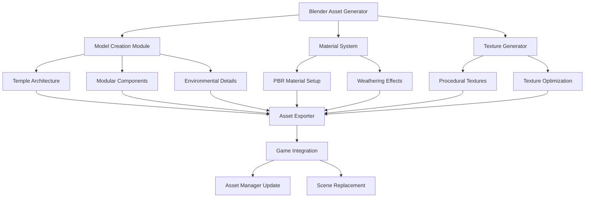

# Design Document

## Overview

This design outlines a comprehensive system for generating professional 3D temple assets using Blender and integrating them into the existing Temple Run-style web game. The system leverages Blender's Python API for automated asset generation, uses modern PBR materials, and exports optimized models for web-based real-time rendering.

## Architecture

### Component Overview



### System Flow

1. **Asset Generation Phase**: Blender scripts create 3D models with materials
2. **Export Phase**: Models are exported as optimized GLTF/GLB files
3. **Integration Phase**: Game asset manager loads new models
4. **Runtime Phase**: New assets are used in game scenes

## Components and Interfaces

### Blender Asset Generator

**Purpose**: Core system for generating 3D temple assets using Blender's Python API

**Key Classes**:

- `TempleAssetGenerator`: Main orchestrator for asset creation
- `ArchitectureBuilder`: Creates temple structures (pillars, walls, pathways)
- `ModularComponentBuilder`: Generates reusable modular pieces
- `EnvironmentalDetailBuilder`: Adds atmospheric and decorative elements

**Interface**:

```python
class TempleAssetGenerator:
    def generate_temple_set(self, style_config, output_path)
    def create_modular_components(self, component_types, variations)
    def apply_weathering_effects(self, models, weathering_level)
    def export_assets(self, export_format, optimization_level)
```

### Material System

**Purpose**: Creates realistic PBR materials for stone, metal, and organic surfaces

**Key Features**:

- Procedural stone texture generation
- Weathering and aging effects
- Moss and vegetation materials
- Metallic accent materials for decorative elements

**Material Types**:

- `AncientStoneMaterial`: Base weathered stone with variations
- `CarvedStoneMaterial`: Detailed stone with inscriptions and carvings
- `MetallicAccentMaterial`: Bronze/gold decorative elements
- `OrganicMaterial`: Moss, vines, and vegetation

### Texture Generator

**Purpose**: Creates optimized textures for web delivery

**Features**:

- Procedural texture generation using Blender nodes
- Automatic texture atlas creation for efficiency
- Multiple resolution outputs (1K, 2K for different LOD levels)
- Compression optimization for web formats

### Asset Exporter

**Purpose**: Exports Blender assets in web-compatible formats

**Export Pipeline**:

1. Geometry optimization (decimation, UV unwrapping)
2. Material baking for complex procedural setups
3. GLTF/GLB export with embedded textures
4. File size optimization and compression

### Game Integration Module

**Purpose**: Integrates new assets into the existing game engine

**Integration Points**:

- Updates `assetManager.js` with new model references
- Replaces geometry in `worldManager.js` and `obstacleManager.js`
- Maintains compatibility with existing collision detection
- Preserves game mechanics while enhancing visuals

## Data Models

### Asset Configuration

```javascript
const AssetConfig = {
  templateStyle: 'ancient_temple',
  components: {
    pathways: {
      straight: { variations: 3, length: 10 },
      curved: { variations: 2, radius: 5 },
      intersection: { variations: 2, branches: 4 },
    },
    architecture: {
      pillars: { variations: 4, height: 8 },
      walls: { variations: 3, height: 6 },
      decorative: { variations: 5 },
    },
    environmental: {
      vegetation: { density: 0.3, types: ['moss', 'vines'] },
      weathering: { level: 0.7, effects: ['erosion', 'staining'] },
    },
  },
  optimization: {
    targetPolyCount: 5000,
    textureResolution: 1024,
    lodLevels: 3,
  },
};
```

### Material Definition

```javascript
const MaterialConfig = {
  baseStone: {
    albedo: [0.6, 0.55, 0.45],
    roughness: 0.8,
    metallic: 0.0,
    normal: 'procedural_stone_normal',
    displacement: 'stone_height_map',
  },
  weatheredStone: {
    albedo: [0.4, 0.35, 0.3],
    roughness: 0.9,
    metallic: 0.0,
    overlays: ['moss_mask', 'dirt_stains'],
  },
};
```

## Error Handling

### Blender Integration Errors

- **Blender Not Available**: Graceful fallback to pre-generated assets
- **Script Execution Failures**: Detailed error logging with recovery options
- **Memory Limitations**: Automatic LOD reduction for complex scenes
- **Export Failures**: Alternative export formats and retry mechanisms

### Asset Loading Errors

- **Missing Files**: Fallback to default placeholder geometry
- **Format Incompatibility**: Automatic format conversion where possible
- **Performance Issues**: Dynamic LOD switching based on device capabilities
- **Texture Loading Failures**: Fallback to solid color materials

### Integration Errors

- **Asset Manager Conflicts**: Version checking and safe replacement
- **Scene Update Failures**: Rollback to previous working assets
- **Performance Degradation**: Automatic quality adjustment

## Testing Strategy

### Unit Testing

- **Blender Script Testing**: Automated tests for each asset generation function
- **Material System Testing**: Validation of PBR material properties
- **Export Pipeline Testing**: Format validation and file integrity checks
- **Integration Testing**: Asset loading and scene replacement verification

### Performance Testing

- **Rendering Performance**: Frame rate impact measurement with new assets
- **Memory Usage**: Asset memory footprint optimization validation
- **Loading Time Testing**: Asset loading speed across different connection types
- **Device Compatibility**: Testing across various hardware configurations

### Visual Quality Testing

- **Asset Comparison**: Before/after visual quality assessment
- **Style Consistency**: Verification that generated assets match target aesthetic
- **Material Accuracy**: PBR material behavior under different lighting conditions
- **Animation Testing**: Smooth integration with existing game animations

### Integration Testing

- **Game Mechanics**: Ensure collision detection works with new geometry
- **Asset Pipeline**: End-to-end testing from Blender generation to game runtime
- **Backward Compatibility**: Verify existing save games and configurations work
- **Cross-Platform**: Testing asset loading across different browsers and devices

## Implementation Phases

### Phase 1: Core Blender Integration

- Set up Blender Python API integration
- Create basic temple geometry generators
- Implement material system foundation

### Phase 2: Asset Generation Pipeline

- Develop modular component system
- Create texture generation and optimization
- Implement export pipeline

### Phase 3: Game Integration

- Update asset manager for new model types
- Integrate assets into existing scenes
- Implement performance optimization

### Phase 4: Polish and Optimization

- Add advanced weathering effects
- Optimize for various device capabilities
- Create asset variation system
